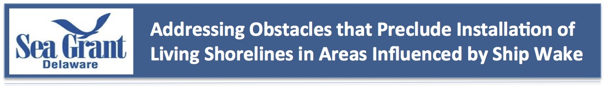
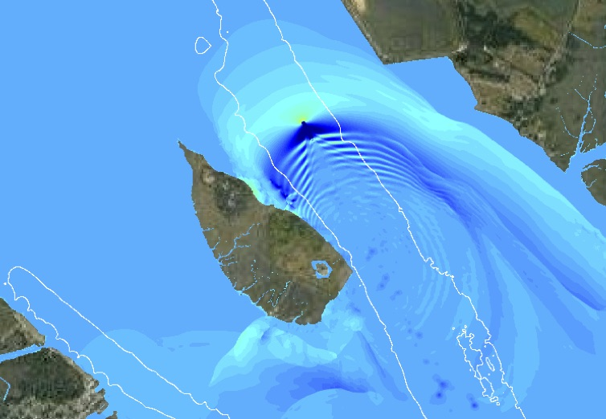

.. nthmp_web documentation master file, created by
   sphinx-quickstart on Thu Apr 18 11:15:55 2019.
   You can adapt this file completely to your liking, but it should at least
   contain the root `toctree` directive.

The project “Addressing Obstacles that Preclude Installation of Living Shorelines in Areas Influenced by Ship Wake” is proposed by Jack A. Puleo, Jules Bruck, and Fengyan Shi as an interdisciplinary research effort. The study seeks to quantify the relative importance of ship wake vs. background wind wave energy affecting tidal wetlands in the DE estuary, develop and test a low-cost living shoreline that can withstand ship wake energy, and design and test methods to enhance the public’s environmental literacy about the value of living shorelines.

Efforts will be achieved through extensive field efforts pre- and post-installation of the living shoreline; through collaboration with a technical review panel consisting of experts from state, local, and non-profit organizations, and professional engineers; and through the calibration/validation of a numerical model for optimal living shoreline design and subsequent predictions of ship wake energy on the installation and DE estuary wetlands. Study impacts include a detailed investigation of the hydrodynamics and dissipation characteristics (rarely undertaken) that will assist in future living shoreline installations, forging ongoing relationships with stakeholders undertaking living shoreline installations, creating a site assessment tool through the numerical model that will be made user-friendly via a graphic user interface, and improving public perception of living shorelines

.. toctree::
   :maxdepth: 2

   progress
   model
   related_work

Indices and tables
==================

* :ref:`genindex`
* :ref:`modindex`
* :ref:`search`
