Results of 4 T--structure designs
***************************************

* Summary

  * Test cases include different vessel sizes, speeds, and heading directions. The following figures show MAXIMUM velocity/wave height with/without structures in some typical cases.  
  * The structures have more significant effects on wash velocity, versus wave height. The maximum blocking efficiency is upto 70% for velocity and 40% for wave height.  
  * The structures block waves from northbound vessels more efficiently than southbound. For southbound vessels, the blocking efficiency drops down half (about 30%) for velocity. 
  * Structures block small wakes more efficiently, than large bore waves (crests). 
  * Large velocities appear in nearfield of strutures, which may indicate local erosion at the structures.  
  * Blocking efficiency for wave height can be negative, caused by bachwash behind the strutures.   
  * The tests were based on NAVD88. Tidal level may have some effects, need to be further investigated. 
  * Model setup, Matlab scripts and figures can be downloaded at `HERE (you must be in UD network) <https://drive.google.com/drive/folders/1vNBZI8x_VyTYy8KeXeV0TXn94lcaTTyS?usp=sharing>`_

* T--structure design

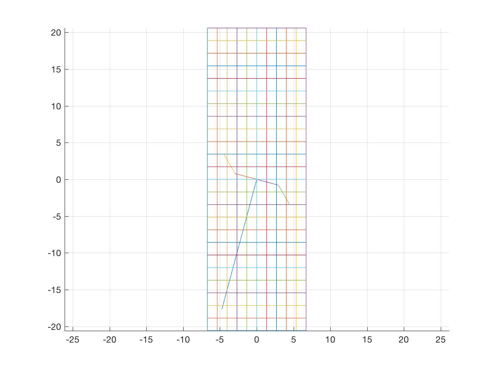

    Figure: T--structure in the grid (meters)

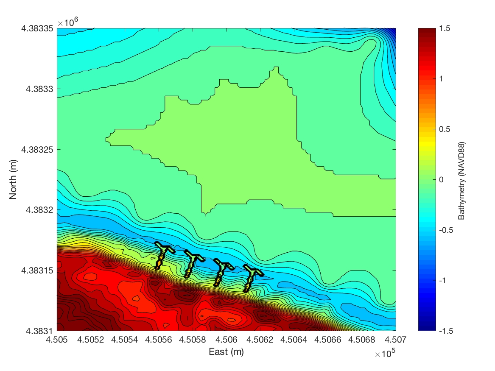

    Figure: T-structures resolved in the grid.

* Comparison of maximum velocity/elevation with/without structures

.. raw:: html

   

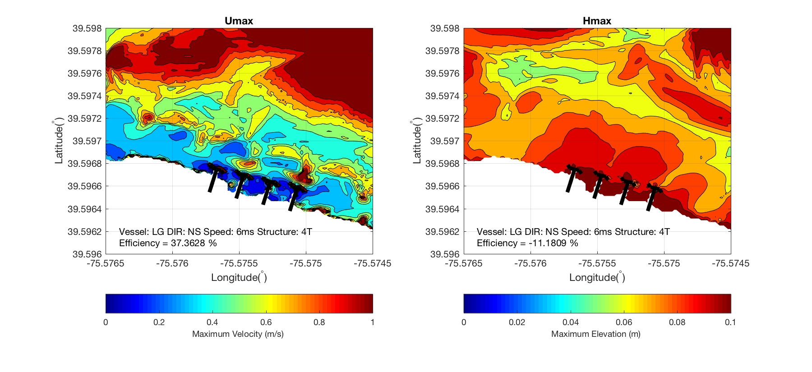

    Figure: Results with structures. Efficiency = [Max(NoStructure)--Max(Structure)]/Max(NoStructure).

    Figure: Results without structures. 

.. raw:: html

   

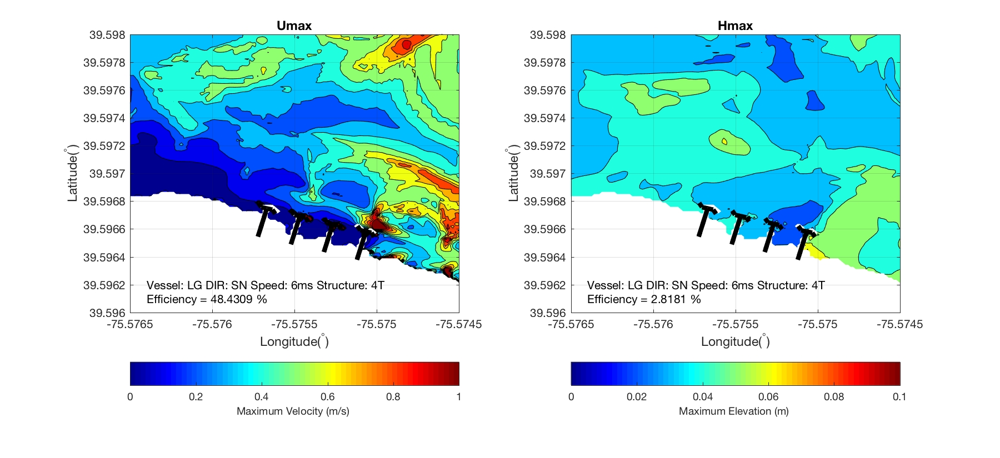

    Figure: Results with structures. Efficiency = [Max(NoStructure)--Max(Structure)]/Max(NoStructure).

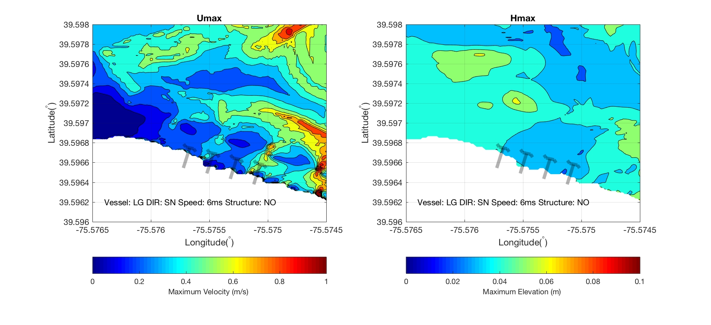

    Figure: Results without structures. 

.. raw:: html

   

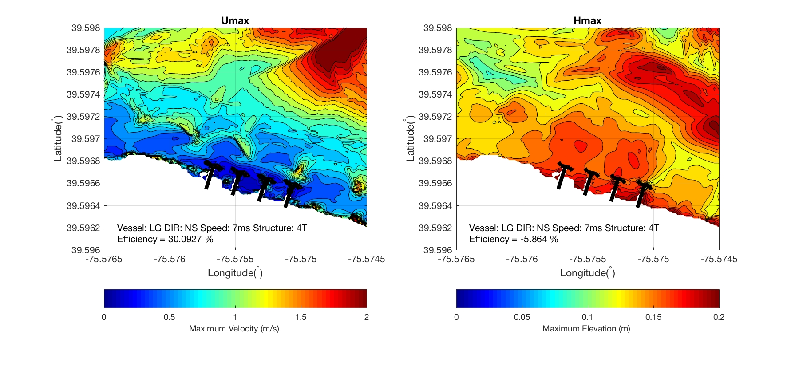

    Figure: Results with structures. Efficiency = [Max(NoStructure)--Max(Structure)]/Max(NoStructure).

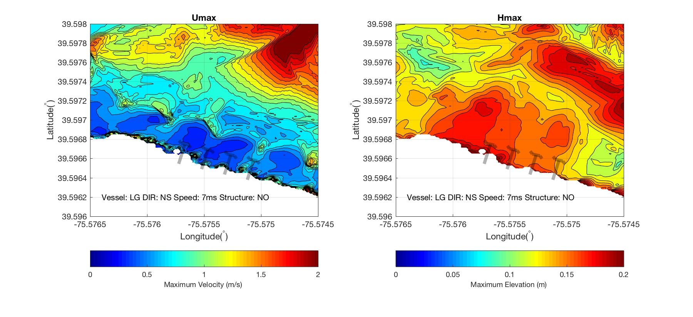

    Figure: Results without structures. 

.. raw:: html

   

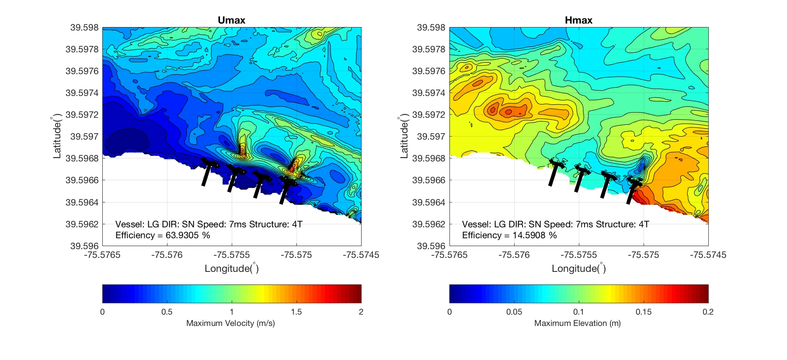

    Figure: Results with structures. Efficiency = [Max(NoStructure)--Max(Structure)]/Max(NoStructure).

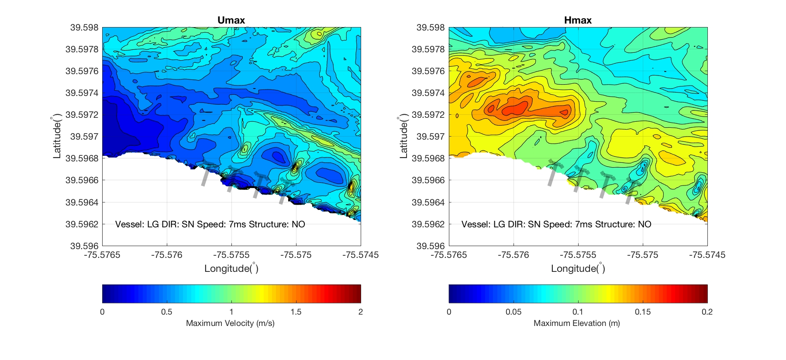

    Figure: Results without structures. 

.. raw:: html

   

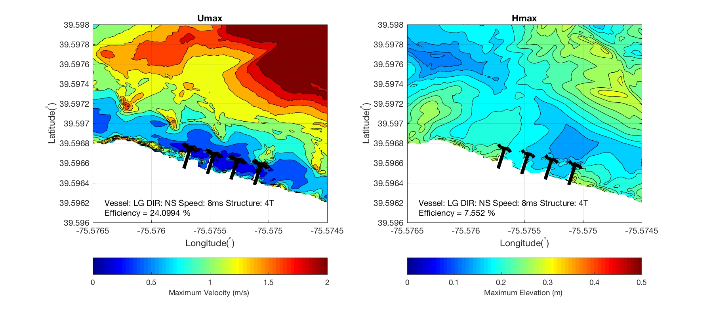

    Figure: Results with structures. Efficiency = [Max(NoStructure)--Max(Structure)]/Max(NoStructure).

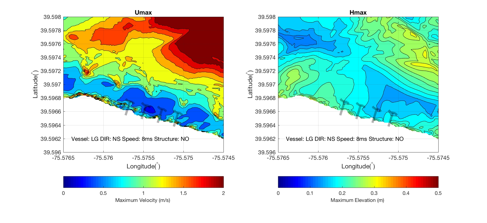

    Figure: Results without structures. 

.. raw:: html

   

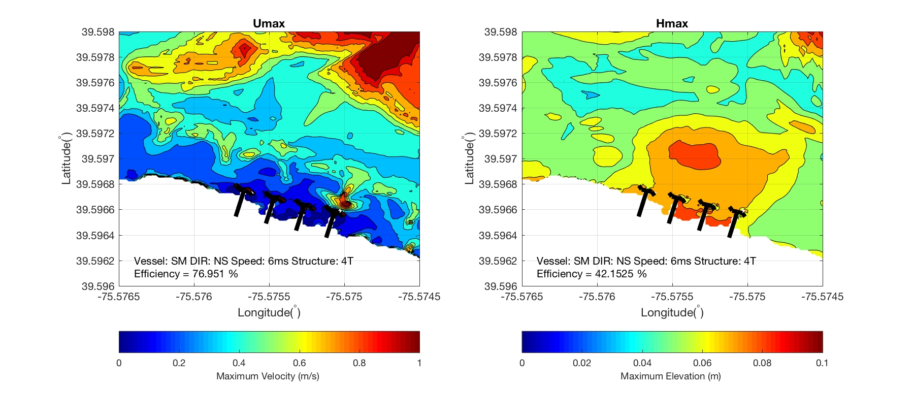

    Figure: Results with structures. Efficiency = [Max(NoStructure)--Max(Structure)]/Max(NoStructure).

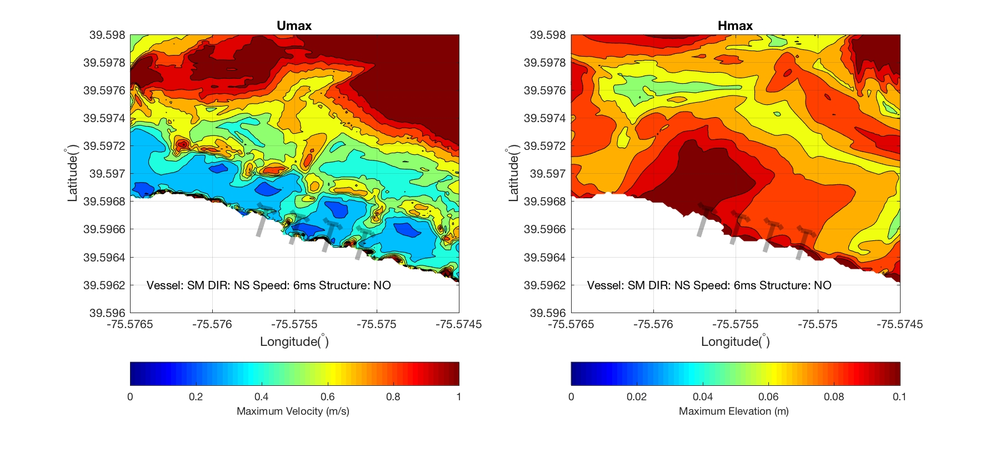

    Figure: Results without structures. 

.. raw:: html

   

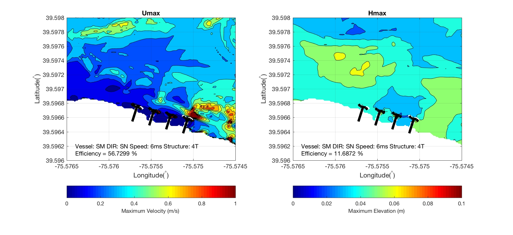

    Figure: Results with structures. Efficiency = [Max(NoStructure)--Max(Structure)]/Max(NoStructure).

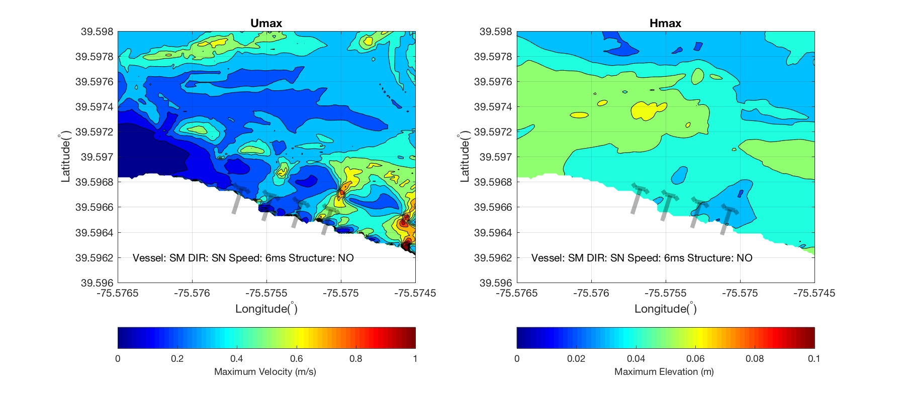

    Figure: Results without structures. 

