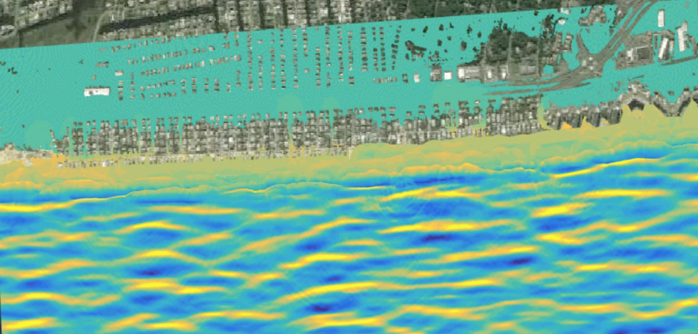
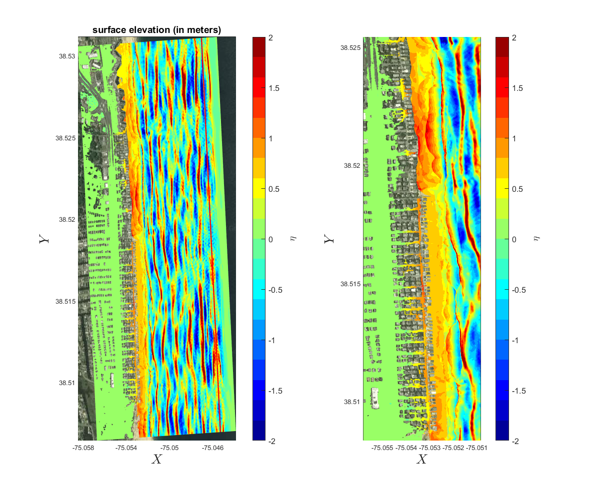

Beach Models, South Bethany Beach
****************************************

*Storm waves, wave overtopping and flooding over streets, a hypothetical storm event.*

.. figure:: images/south_bethany/bathy_topo.png

*The bathymetric/topographic data combine the USGS bare earth LiDAR data building structure data*

.. figure:: images/south_bethany/waves_no_erosion.png

*Storm waves, wave overtopping and flooding over streets, a  100 yr storm without taking into account dune erosion.*

*Storm waves, wave overtopping and flooding over streets, a  100 yr storm with taking into account dune erosion.*

 * Debris tracking 

.. raw:: html

 <iframe width="560" height="315" src="https://www.youtube.com/embed/zG6bPa95yPY?rel=0" frameborder="0" allow="autoplay; encrypted-media" allowfullscreen></iframe>

* Debris tracking (path) 

.. raw:: html

 <iframe width="560" height="315" src="https://www.youtube.com/embed/rJXbP-IZaXU?rel=0" frameborder="0" allow="autoplay; encrypted-media" allowfullscreen></iframe>