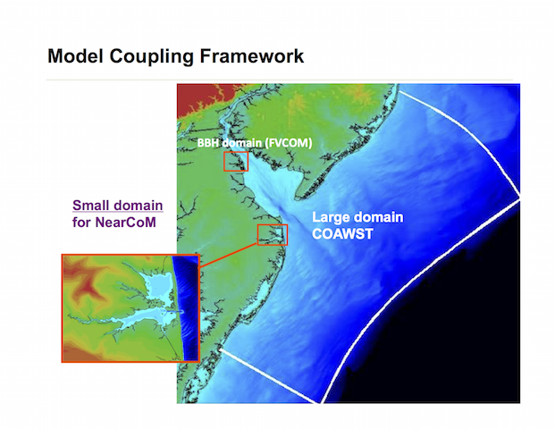

**RELATED WORK**
=====================================

*Delaware models for predicting storm surges and coastal inundation are developed in a coupled model system. The system includes a large domain model, COAWAST and several nested small domain models such as the inlandbay model, brockonbridge marsh model, murderkill model, and beach models.*

.. toctree::
   :maxdepth: 2
   
   related_automate_system.rst
   related_inlandbays.rst
   related_south_bethany.rst
   related_brockonbridge.rst
   related_murderkill.rst
   related_wilmington.rst
   